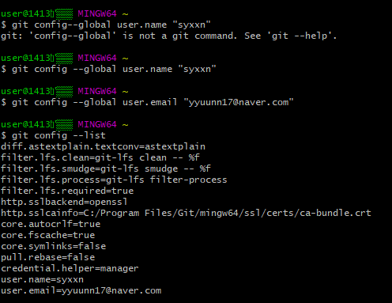
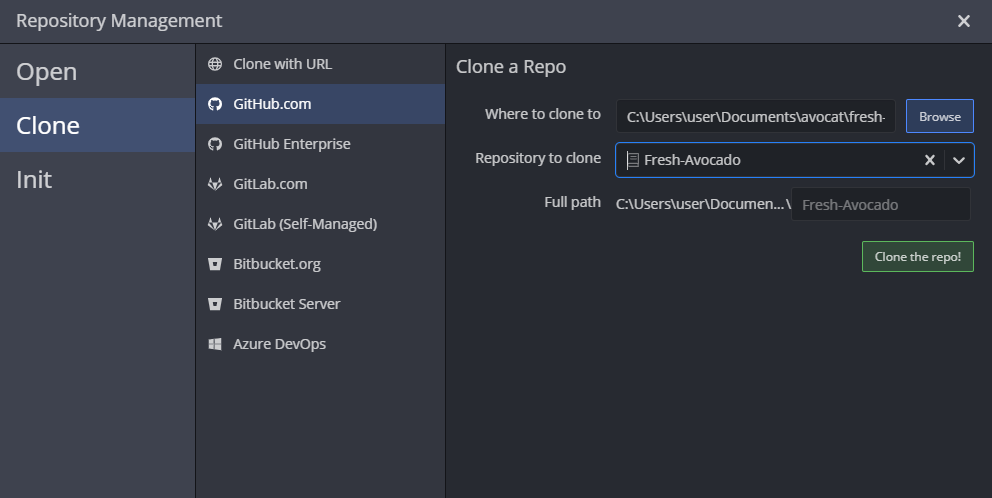

# **GIT**

## 깃이란?

> 컴퓨터 파일의 변경사항을 추적하고 여러 명의 사용자들 간에 해당 파일들의 작업을 조율하기 위한 분산 버전 관리 시스템
>
> -> 여러사람이 공동으로 사용 가능~~(소회의실 느낌)~~

> 깃은 많은 GUI를 지원하는 것이 특징이다. 현재 [소스트리](https://ko.wikipedia.org/wiki/소스트리), GitHub Desktop 등의 여러 GUI를 사용할 수 있다.

 ## GUI란?

+ 그래픽 사용자 인터페이스(**graphical user interface**, **GUI**)는 사용자가 편리하게 사용할 수 있도록 입출력 등의 기능을 알기 쉬운 아이콘 따위의 그래픽으로 나타낸 것


## Git의 특징

* *누가 어떤 코드를 언제 수정했는지 트래킹 할 수 있다*
* *팀 자체의 소스코드를 관리하기 용이하다*
* 내가 올리려는 파일이 누군가 편집한 내용과 충돌한다면, 서버에 업로드 할 때 경고 메세지가 발생됩니다. 

## GIT 저장소 만들기

1. git bash 실행
2. 적당한 경로에 관리할 프로젝트 디렉토리 생성
3. 프로젝트 디렉토리에 "git init" 입력.
4. ".git" 파일이 생성되면 완료.

## GIT에 내 정보 등록하기(1회만 하면 됨)

+ git config --global user.name "(내 닉네임)"

+ git config --global user.email "(내 이메일)"

  위의 두 명령으로 버전에 포함될 버전을 만든 사람에 대한 정보를 설정한다. 이 설정은 ~/gitconfig 파일에 저장된다.

  [git config -- list] 명령어로 git 설정값들을 확인할 수 있음.

<<<<<<< Updated upstream

=======
<<<<<<< Updated upstream

=======
```default

```
> 괄호로 이미 구분해줘서 파일 경로인걸 이미 알고 있음/ 
>
> 마크다운 파일과 이미지의 상대경로가 같기 때문에, 이미지 파일 이름만 
>
> 써줘도 괜찮음.

>>>>>>> Stashed changes


>>>>>>> Stashed changes


## 깃 크라켄 사용법

: 수정된게 있으면 pull을 받아라.

내가 수정된걸 깃허브에 올리려면 push를 해라

잊지말긔.


## 깃 명령어

:

git init : git 생성하기

git clone git_path : 코드가져오기

git checkout branch_name : 브랜치 선택하기

git checkout -t remote_path/branch_name : 원격 브랜치 선택하기

git branch branch_name : 브랜치 생성하기

git branch -r : 원격 브랜치 목록보기

git branch -a : 로컬 브랜치 목록보기

git branch -m branch_name change_branch_name : 브랜치 이름 바꾸기

git branch -d branch_name : 브랜치 삭제하기

git push remote_name — delete branch_name : 원격 브랜치 삭제하기 ( git push origin — delete gh-pages )

git add file_path : 수정한 코드 선택하기 ( git add * )

git commit -m “commit_description” : 선택한 코드 설명 적기 ( git commit -m “내용”)

git push romote_name branch_name : add하고 commit한 코드 git server에 보내기 (git push origin master)

git pull : git서버에서 최신 코드 받아와 merge 하기

git fetch : git서버에서 최신 코드 받아오기

git reset — hard HEAD^ : commit한 이전 코드 취소하기

git reset — soft HEAD^ : 코드는 살리고 commit만 취소하기

git reset — merge : merge 취소하기

git reset — hard HEAD && git pull : git 코드 강제로 모두 받아오기

git config — global user.name “user_name ” : git 계정Name 변경하기

git config — global user.email “user_email” : git 계정Mail변경하기

git stash / git stash save “description” : 작업코드 임시저장하고 브랜치 바꾸기

git stash pop : 마지막으로 임시저장한 작업코드 가져오기

git branch — set-upstream-to=remote_path/branch_name : git pull no tracking info 에러해결